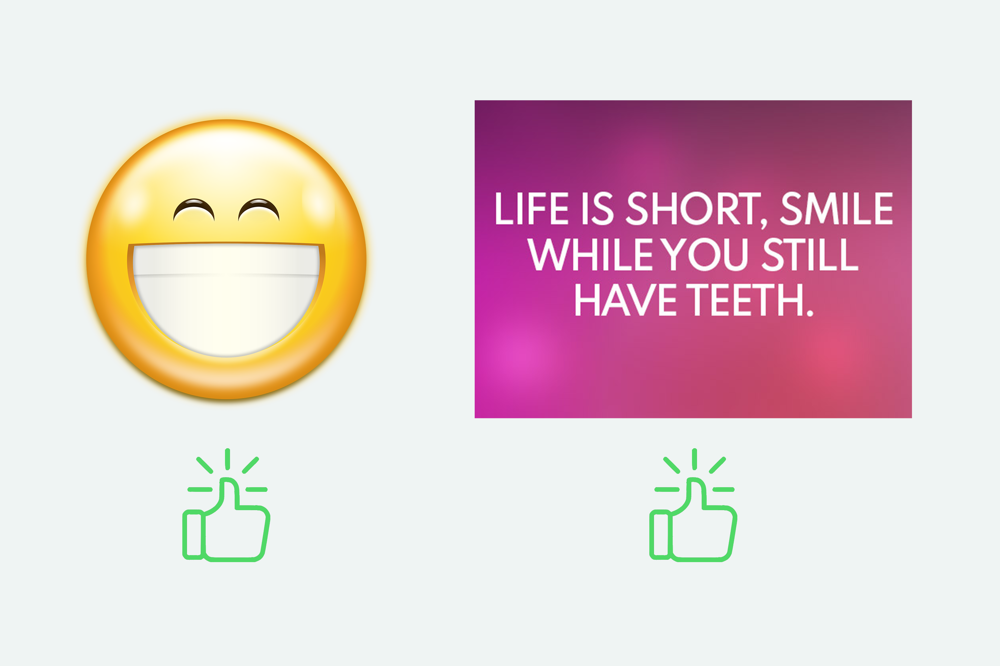
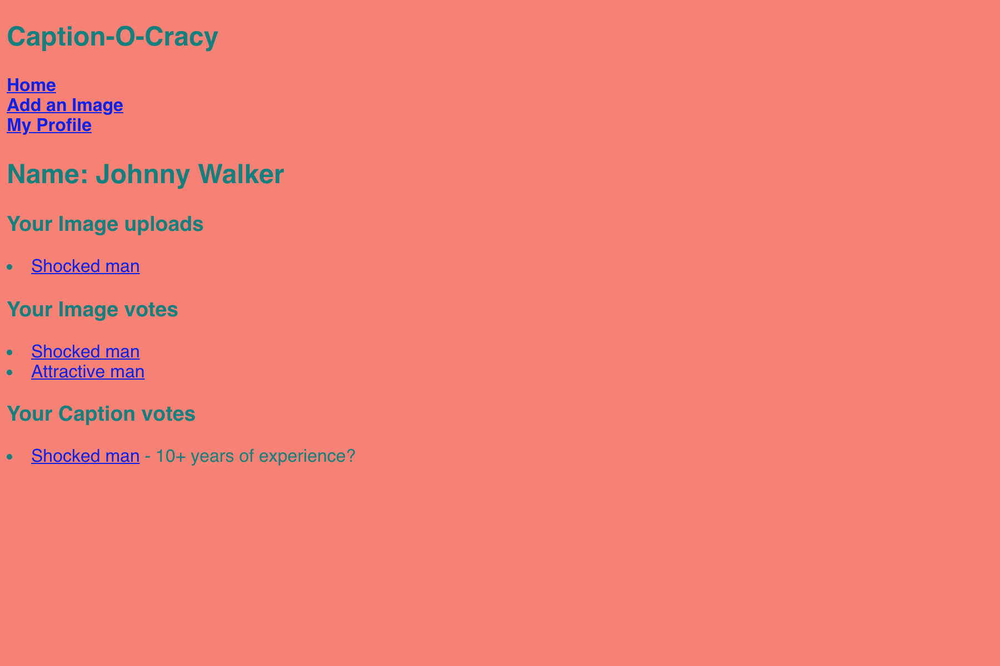
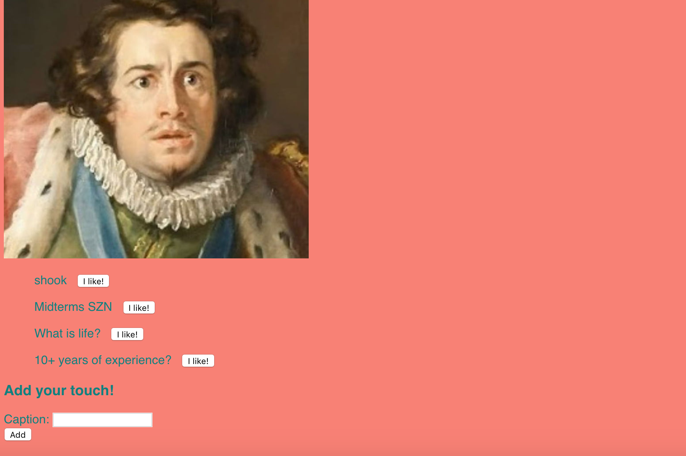
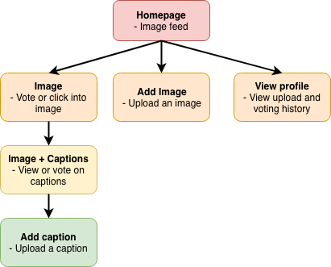

# Caption-o-cracy


## Overview 
What if you found an image on the Web and you know it is dying for a witty caption? Caption-o-cracy is here for you!

You can upload your image, and other users can upvote it if they think it's cool. Within your image upload, other users can upload their captions and be voted on. To make things easier, the app will rank each image and caption by its upvotes, so that you can find the best images and captions for today.

## Data Model <br/>
The application will store Users (Vote and Upload history), Images, and Image-Captions

Each Image has its own ID (Collision avoiding algorithm needed) </br>
Each Image has its Captions DB </br>

An Example User: 
> Will research into the integration with Facebook API and how it represents each user

``` javascript
{
	faceBook_username: "Jack Daniels",
	faceBook_hash: ********,
	site_username: "Jack0245", //Custom username for the app - Collision detection and prompt new username input
	history: [ [Image upload history] [Image voting history] [Caption upload history] [Caption voting history] ]
}
```

An Example Image: </br>
``` javascript
{
	name: "FunnyImage",
	creatorName: "Jack0245", //Link to userID
	score: 3 // # of upvotes
	captionsDB: // Captions uploaded by users
}
```

An example caption: </br>
``` javascript
{
	caption: "Gotta miss class because of that"
	captionCreator: "Ruby542"
	score: 5 // # of upvotes
}
```

## Link to db.js of Schema </br>

## Wireframes: </br>
Home - Image Feed </br>

</br>

Upload Image </br>

</br>

View Profile </br>

</br>

View and Vote on Captions </br>

</br>

## Site-map: </br>


## User stories and interactions:
1) Upload images
2) Upload captions
3) Upvote on captions
4) Upvote on images
5) View images & captions

## Modules for research</br>
- 6 points -> Integrate Facebook Login for the web
- 2 points -> Use Bootstrap CSS

## Link to main project file (skeleton app) </br>
[Available here](src/app.js)

## References: </br>
Facebook login - https://developers.facebook.com/docs/facebook-login/web#redirecturl </br>
Bootstrap - http://getbootstrap.com/docs/4.1/getting-started/introduction/

