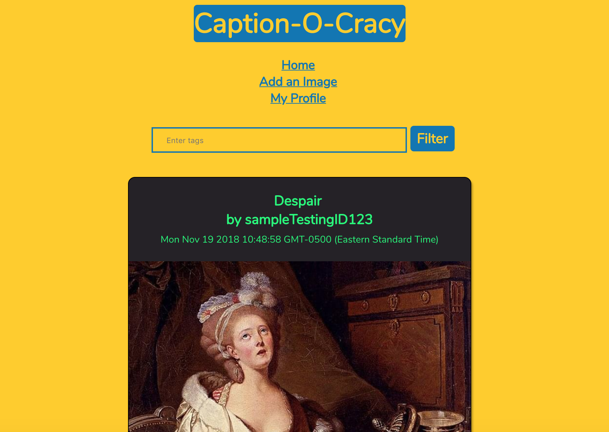
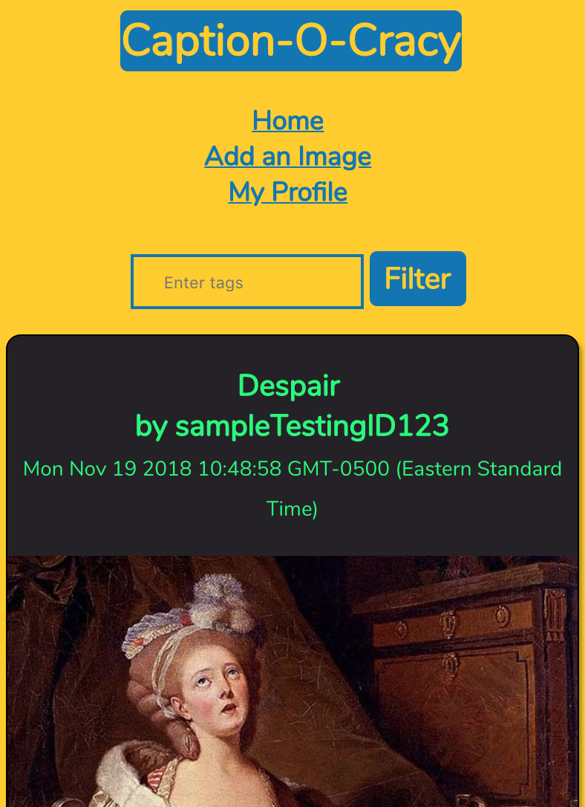
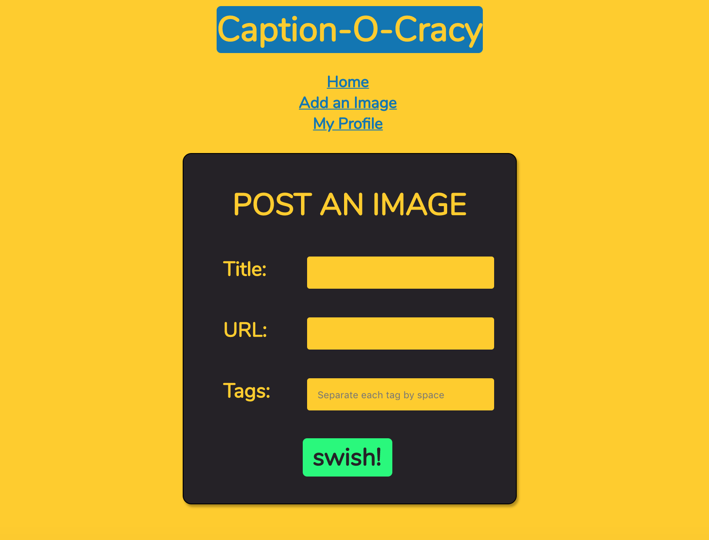
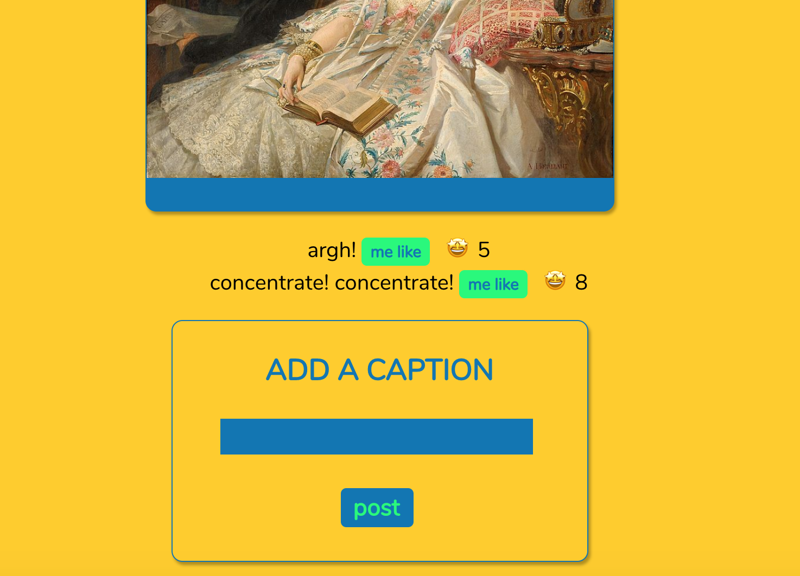

# Caption-o-cracy


## Progress log
### Summary for Milestone #2
1. Implemented basic functionalities of the site:
	- User can upload an image via URL
	- User can view uploaded images at homepage
	- User can do an "upvote" on images: Total votes for an image is also viewable
		- Real-time update when a vote is casted by the user via client-side javascript
	- User can upload a caption for each image
	- User can do an "upvote" on captions
		- Real-time update when a vote is casted by the user via client-side javascript

2. Implemented UI design with Sass and CSS:
	- Customized elements of the site, including:
		- Font
		- Headers
		- Display boxes
		- Forms
		- Buttons
	- UI and Screen size responsivity

3. Features to be implemented
	- Images ranked by votes in homepage
	- Captions ranked by votes in image-caption page
	- Viewable user profiles
	- User authentication via Passport
	- Client-side input verification

### Wireframes from [website](http://linserv1.cims.nyu.edu:14930/)
Homepage with UI created with Sass </br>

</br>
Homepage with a smaller screen </br>

</br>
Upload an image </br>

</br>
Add a caption </br>

</br>

## Overview 
What if you found an image on the Web and you know it is dying for a witty caption? Caption-o-cracy is here for you!

You can upload your image, and other users can upvote it if they think it's cool. Within your image upload, other users can upload their captions and be voted on. To make things easier, the app will rank each image and caption by its upvotes, so that you can find the best images and captions for today.

## Data Model
The application will store Users (Vote and Upload history), Images, and Image-Captions

Each Image has its own ID (Collision avoiding algorithm needed) </br>
Each Image has its Captions DB </br>

An Example User: 
> Will research into the integration with Facebook API and how it represents each user

``` javascript
{
	username: "Jack Daniels", //Custom username for the app - Collision detection and prompt new username input
	password_hash: ********,
	history: [ [Image upload history] [Image voting history] [Caption upload history] [Caption voting history] ]
}
```

An Example Image: </br>
``` javascript
{
	name: "FunnyImage",
	creatorName: "Jack0245", //Link to userID
	score: 3 // # of upvotes
	captionsDB: // Captions uploaded by users
}
```

An example caption: </br>
``` javascript
{
	caption: "Gotta miss class because of that"
	captionCreator: "Ruby542"
	score: 5 // # of upvotes
}
```

## Link to db.js of Schema </br>
[Available here](src/db.js)

## Wireframes: </br>
Home - Image Feed </br>

</br>

Upload Image </br>

</br>

View Profile </br>

</br>

View and Vote on Captions </br>

</br>

## Site-map: </br>


## User stories and interactions:
1) Upload images
2) Upload captions
3) Upvote on captions
4) Upvote on images
5) View images & captions
6) Filter images by tags

## Modules for research</br>
- 5 points -> Integrate Passport Login for the web, disabling uploads for unauthenticated users.
- 2 points -> Use Bootstrap CSS, create readable and mobile friendly UI
- 1 point -> Have client-side verification for data inputs, let users know of errors and correct them before wondering if their incorrect data is uploaded or not

## Link to main project file (app in progress) </br>
[Available here](src/app.js)

## References: </br>
Passport login - http://www.passportjs.org/ </br>
Bootstrap - http://getbootstrap.com/docs/4.1/getting-started/introduction/ </br>
Input verification - https://www.w3schools.com/js/js_validation.asp

